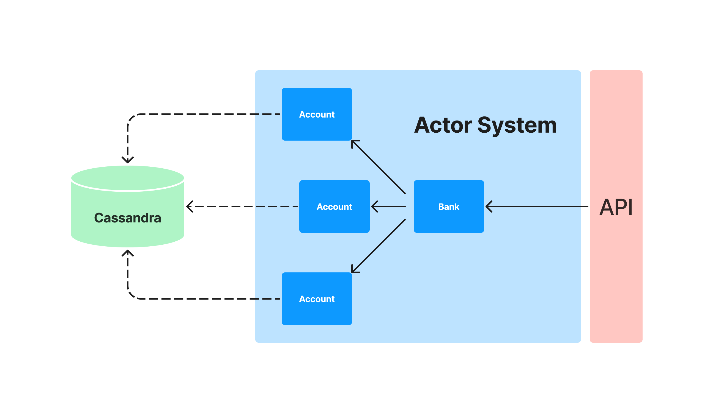

# README

[](https://github.com/olivmath/mini-bank/actions/workflows/test.yml)

- An actor model based mini bank application where users can: create bank accounts, see your data, deposit and withdraw money.

## CREDITS

- [Rock The JVM](https://github.com/rockthejvm)
- [Tutorial](https://youtube.com/playlist?list=PLmtsMNDRU0BwOoOByyvdDanace6rltT2e)

## HOW TO INSTALL

**PRE-REQ**

- [x] [Docker](https://docs.docker.com/get-docker/)
- [x] [Sbt](https://www.scala-sbt.org/download.html)

**HOW TO WORKS**


**HOW TO RUN**

Up Cassadrana DataBase

```
docker-compose up
```

Run your Mini-Banks

```
sbt run
```

## READTHEDOCS

- [RockTheJVM](https://blog.rockthejvm.com/akka-cassandra-project/)

## CONTRIBUTING

- [CONTRIBUTING](CONTRIBUTING)

## LINCENSE

- [MIT](LINCENSE)
